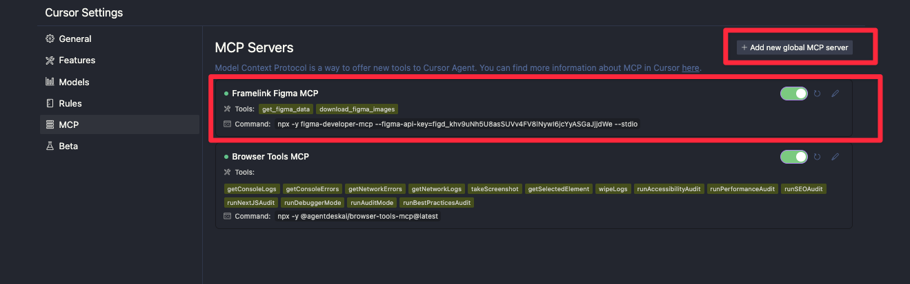
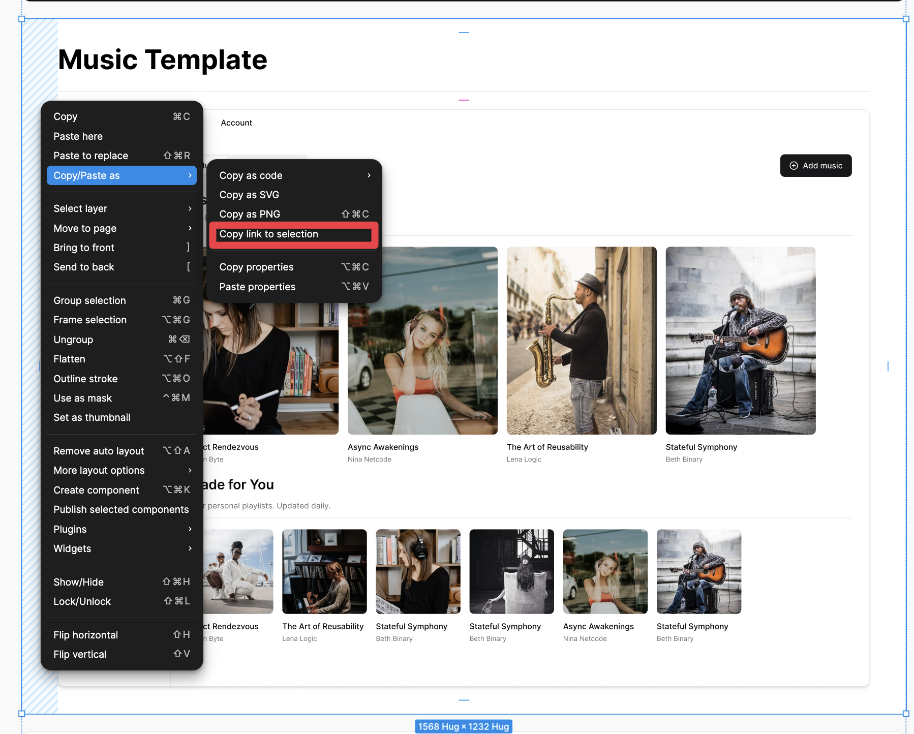
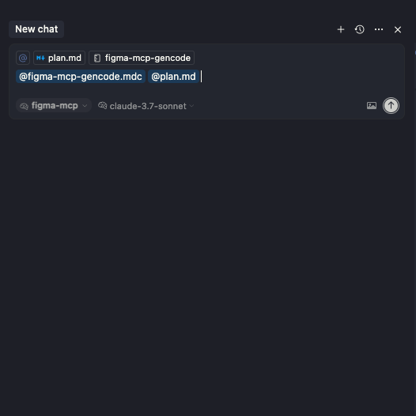

# Figma MCP Setup & Usage

This document describes how to set up and use the Figma MCP tool to download design assets from Figma and generate code in our Next.js + Shadcn UI + Tailwind CSS project.

## Prerequisites

- Node.js >= 16
- pnpm installed (https://pnpm.io/)
- A Figma account with a personal access token (https://www.figma.com/developers/api)
- Read MCP Figma Developer Guide (https://github.com/GLips/Figma-Context-MCP)
- Access to the Figma file URL and relevant node IDs


## Installation

1. Navigate to the project root:
   ```bash
   nvm alias default 23.11.0
   ```

## Configuration
Go to Cursor setting and click setting `mcp.json` 

Create setting `mcp.json` 
```env
{
  "mcpServers": {
    "Framelink Figma MCP": {
      "command": "npx",
      "args": [
        "-y",
        "figma-developer-mcp",
        "--figma-api-key=",
        "--stdio"
      ]
    }
  }
}
```  
After that, check it is active.

## Usage

### Analyze design and download assets
1. Open figma file and get the `Figma-File-URL` of the screen you want to analyze.


2. Use the `analyze` command to export node data and assets for a specific screen:
Open Cursor chat and create a new agent name`figma-mcp` for create figma mcp analysis. 

Run this command to analyze the design and download assets:
There are 3 command to analyze:
- `@figma-mcp-surface-analyze.mdc <Figma-File-URL>`: Analyze the design and download assets for a specific screen in surface. (default)
- `@figma-mcp-surface-analyze.mdc --scope=component --page=<page-name> <Figma-File-URL>`: Analyze the design and download assets for a specific component in a specific page in surface.
- `@figma-mcp-extension-analyze.mdc <Figma-File-URL>`: Analyze the design and download assets for a specific page webapp-x-extension.

This will:
- Download SVG and image assets to `public/images/<screen-name>`
- Export node data JSON to `figma-data/<screen-name>/<screen-name>-node-data.json`

### Generate plan

After analyzing, it will generate a detailed implementation plan:

Open and review `docs/figma/<screen-name>/plan.md` - Always review and approve the plan before generating code to avoid unintended changes.


### Generate code

Once the plan is approved, scaffold pages and components:
Open Cursor chat and switch to mode `agent` and create a created agent name `figma-mcp` for generate code. Run this command to generate code:

```bash
@figma-mcp-gencode @plan.md
```


